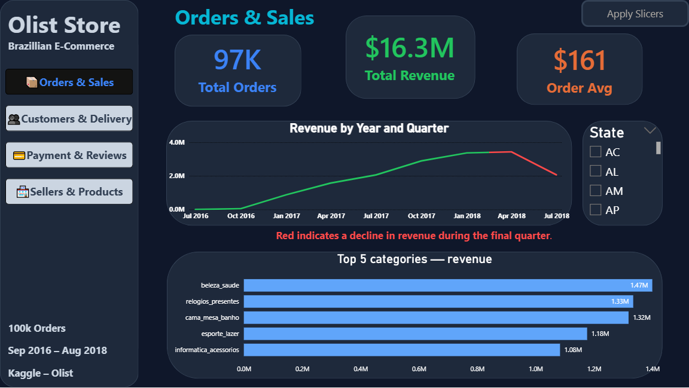
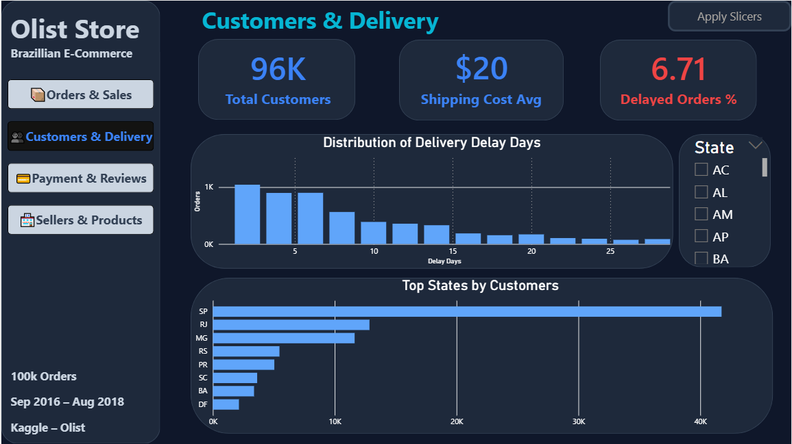
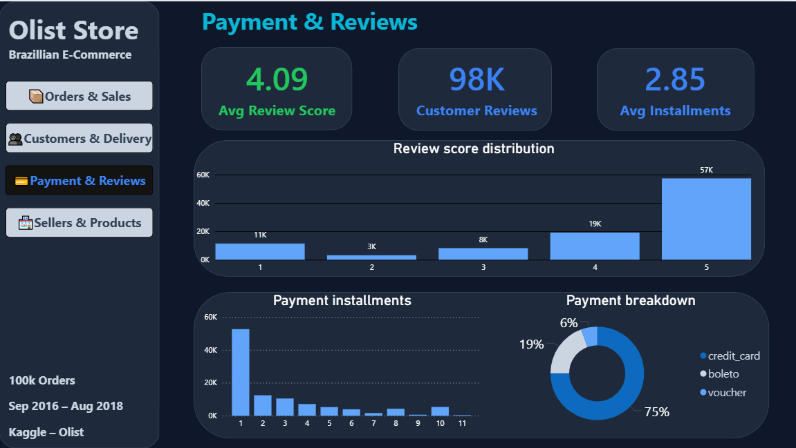
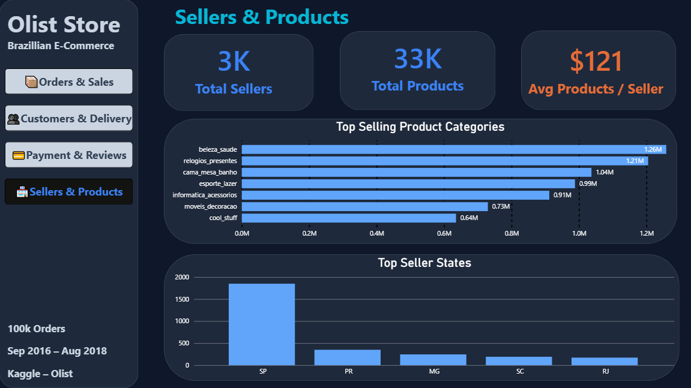

# Olist Store | Brazilian E-Commerce Analytics Dashboard

## Project Overview

This project analyzes the **Brazilian E-Commerce Public Dataset (Olist)** using **Python** and **Power BI** to uncover actionable business insights related to sales, customers, products, payments, sellers, and delivery performance.

The project follows the complete data analytics workflow:

* Data Cleaning
* Data Transformation
* Exploratory Data Analysis (EDA)
* Feature Engineering
* Data Modeling
* Interactive Dashboard Development

---

#  Dataset

* **Source:** Kaggle – Brazilian E-Commerce Public Dataset by Olist
* **Period:** September 2016 – August 2018
* **Orders:** ~100K
* **Customers:** ~96K
* **Products:** ~33K
* **Sellers:** ~3K
* **Link of DataSet https://www.kaggle.com/datasets/olistbr/brazilian-ecommerce

---

# 🛠️ Tools & Technologies

### Python

* Pandas
* NumPy
* Matplotlib

### Power BI

* Data Modeling
* DAX Measures
* Interactive Visualizations
* Page Navigation
* Slicers
* KPI Cards

---

# Data Preparation

The dataset was prepared using Python by:

* Handling missing values
* Removing duplicates
* Fixing data types
* Creating calculated columns
* Feature engineering
* Merging multiple datasets into a final analytical dataset

### Created Features

* Total Cost
* Delivery Delay (Days)
* Delivery Time (Days)
* Approval Time (Hours)

---

# 📊 Dashboard Pages

## 📦 1. Orders & Sales

**KPIs**

* Total Orders
* Total Revenue
* Average Order Value

**Visualizations**

* Revenue Trend
* Top Product Categories by Revenue
* State Filter

---

## 👥 2. Customers & Delivery

**KPIs**

* Total Customers
* Average Shipping Cost
* Delayed Orders %

**Visualizations**

* Delivery Delay Distribution
* Top Customer States
* State Filter

---

## 💳 3. Payment & Reviews

**KPIs**

* Average Review Score
* Total Reviews
* Average Installments

**Visualizations**

* Review Score Distribution
* Payment Installments
* Payment Method Breakdown

---

## 🏪 4. Sellers & Products

**KPIs**

* Total Sellers
* Total Products
* Average Products per Seller

**Visualizations**

* Top Selling Product Categories
* Top Seller States

---

#  Key Insights & Business Recommendations

## 🚚 Delivery Performance

Approximately **6.7%** of all orders were delivered later than the estimated delivery date. Delivery delays have a significant impact on customer satisfaction, with the average review score dropping from **4.18/5** for on-time deliveries to **2.25/5** for delayed orders.

**Recommendation**

* Optimize shipping routes and logistics operations.
* Monitor sellers with frequent late deliveries.
* Provide proactive delivery notifications.
* Improve delivery time estimation accuracy.

---

## 📦 Sales Performance

The marketplace generated over **$16M** in revenue, with a relatively small number of product categories contributing the majority of sales.

**Recommendation**

* Prioritize inventory and marketing efforts for top-performing categories.
* Promote underperforming categories to diversify revenue sources.

---

## 👥 Customer Insights

The platform serves approximately **96K unique customers**, with demand highly concentrated in a few Brazilian states.

**Recommendation**

* Focus marketing campaigns on high-performing regions.
* Expand logistics and promotional activities in underrepresented states.

---

## 💳 Payment Behavior

Credit cards are the preferred payment method, and most customers choose to pay in a single installment.

**Recommendation**

* Continue optimizing the credit card payment experience.
* Introduce installment promotions for higher-value purchases.

---

## 🏪 Sellers & Products

The marketplace includes around **3K sellers** offering more than **33K products**. Sales are concentrated within a limited number of product categories.

**Recommendation**

* Support sellers in low-performing categories through targeted campaigns.
* Improve product visibility using category-based recommendations.

# 🚀 Conclusion

This project demonstrates an end-to-end Business Intelligence workflow, starting from raw data preprocessing in Python and ending with a professional interactive Power BI dashboard that helps stakeholders monitor sales performance, customer behavior, delivery efficiency, payment patterns, and product performance.
